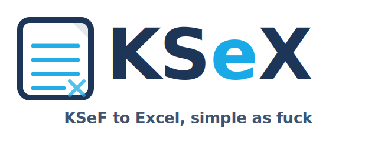

  

Aplikacja pobiera dane z z KSeF i przerzuca do estetycznego arkusza Google Sheets.

## Konfiguracja
### Google Sheets – Service Account
1) Utwórz Service Account i pobierz JSON key.
2) Udostępnij arkusz (Share) na e-mail Service Account.
3) Włącz Sheets API w projekcie Google Cloud.
### Środowisko
W repo ustaw sekrety (GitHub: Settings → Secrets and variables → Actions):

- GOOGLE_SERVICE_ACCOUNT_JSON_BASE64 (base64 z JSON key)
- LOOKBACK_DAYS (opcjonalnie, domyślnie 7)

Dla każdej firmy (1 i 2):
- COMPANY{n}_NAME
- COMPANY{n}_NIP
- COMPANY{n}_KSEF_TOKEN lub COMPANY{n}_REFRESH_TOKEN
- COMPANY{n}_SPREADSHEET_ID (wymagane)
